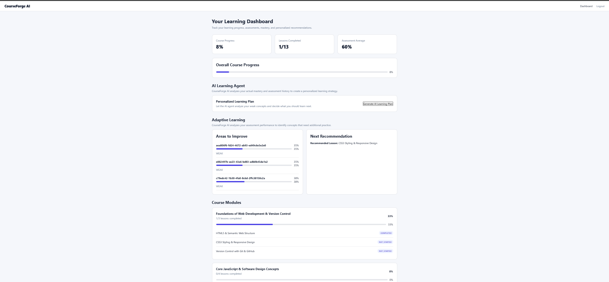
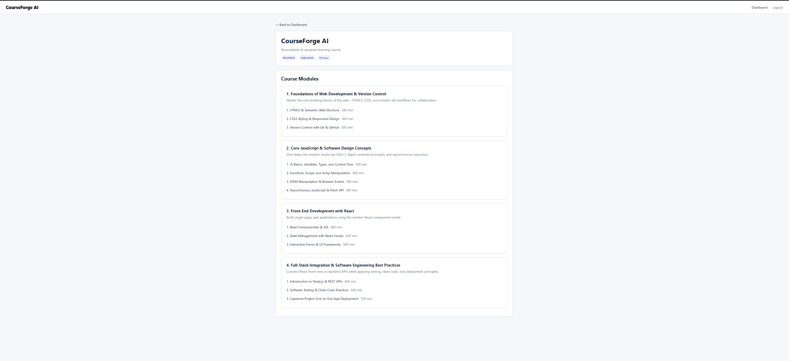
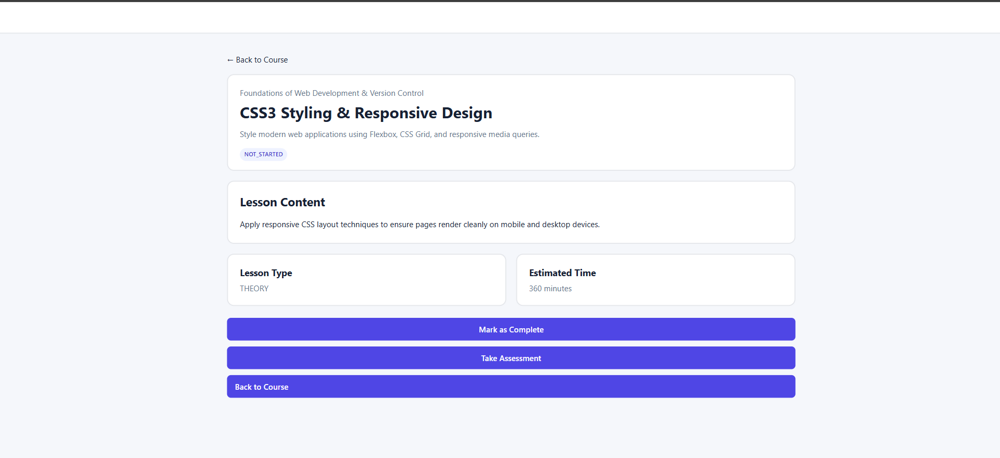
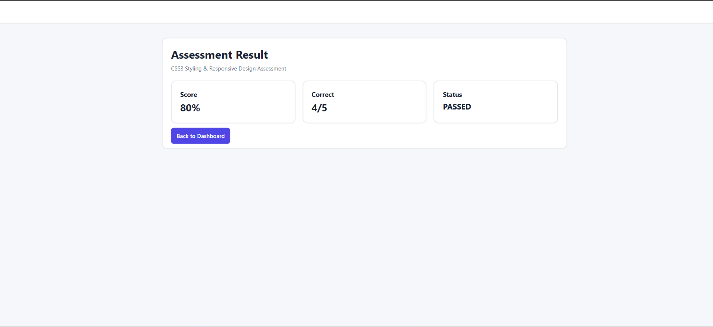
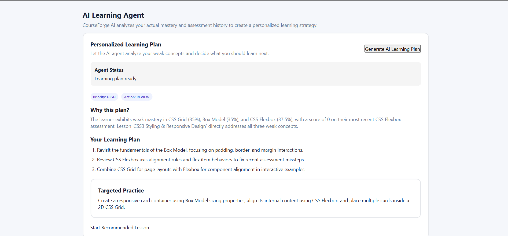

<div align="center">

# 🚀 CourseForge AI

### AI-Powered Adaptive Learning Platform

**Learn → Assess → Measure → Adapt → Improve**

A full-stack learning platform that combines **LLM-powered Agentic AI, adaptive learning, concept-level mastery tracking, assessments, real-time communication, and WebRTC-based live learning** into one personalized learning experience.

<br/>

[](https://ai-course-builder-kdbzkt0bn-utkarsh-rode.vercel.app/)
[](https://react.dev/)
[](https://nodejs.org/)
[](https://expressjs.com/)
[](https://www.postgresql.org/)
[](https://www.prisma.io/)
[](https://socket.io/)
[](https://webrtc.org/)
[](https://vercel.com/)

</div>

---

## ✨ What is CourseForge AI?

Most learning platforms follow a fixed path:

```text
Course → Lesson → Quiz → Completion
```

**CourseForge AI closes the loop.**

The learner's assessment performance is converted into **concept-level mastery**, weak concepts are identified, relevant lessons are recommended, and an **AI learning agent** uses that learner state to generate a personalized learning strategy.

```text
                     ┌───────────────────┐
                     │      Learner      │
                     └─────────┬─────────┘
                               │
                               ▼
                     ┌───────────────────┐
                     │ Courses & Lessons │
                     └─────────┬─────────┘
                               │
                               ▼
                     ┌───────────────────┐
                     │    Assessment     │
                     └─────────┬─────────┘
                               │
                               ▼
                     ┌───────────────────┐
                     │ Concept Mastery   │
                     └─────────┬─────────┘
                               │
                 ┌─────────────┴─────────────┐
                 ▼                           ▼
        ┌─────────────────┐        ┌─────────────────┐
        │   Weak Areas    │        │  AI Agent       │
        │   Detection     │───────▶│  Analysis       │
        └────────┬────────┘        └────────┬────────┘
                 │                          │
                 └────────────┬─────────────┘
                              ▼
                   ┌─────────────────────┐
                   │ Personalized Plan   │
                   │ + Targeted Practice │
                   └─────────────────────┘
```

---

# 🎯 Core Features

| Feature | What it does |
|---|---|
| 🤖 **Agentic AI Learning** | An LLM-powered learner agent analyzes learner state and generates a personalized learning strategy. |
| 🧠 **Adaptive Learning** | Uses concept mastery and assessment performance to determine what the learner should work on next. |
| 📚 **Structured Courses** | Organizes learning into courses, modules, lessons, concepts, and progress states. |
| 📝 **Assessments** | Generates lesson assessments, collects answers, evaluates attempts, and records results. |
| 📊 **Concept Mastery** | Tracks understanding at the concept level rather than relying only on overall quiz scores. |
| 🎯 **Weak-Area Detection** | Identifies concepts below the configured mastery threshold. |
| 🔎 **Recommendations** | Maps weak concepts back to relevant lessons and recommends the next learning step. |
| ⚡ **Real-Time Agent Updates** | Uses Socket.IO/WebSockets for real-time learner-agent status updates. |
| 🎥 **Live Learning** | Uses WebRTC for peer-to-peer audio/video communication. |
| 🔐 **Authenticated APIs** | Protects learner-specific routes and application data. |

---

# 🧠 Agentic AI Learning Engine

The strongest part of CourseForge AI is not simply "an AI chatbot."

The learner agent operates on **actual learner state**.

It can reason over information such as:

```text
Assessment History
        +
Concept Mastery
        +
Weak Concepts
        +
Course / Lesson Context
        ↓
   Agent Analysis
        ↓
   Agent Decision
        ↓
 Personalized Plan
        +
 Targeted Practice
```

### Example from the deployed application

The production AI agent identified:

- **CSS Grid:** 35% mastery
- **Box Model:** 35% mastery
- **CSS Flexbox:** 37.5% mastery
- Recent CSS Flexbox assessment score: **0%**
- Recommended lesson: **CSS3 Styling & Responsive Design**

It then generated a concrete three-step learning plan and a targeted practice task.

> This is the key distinction between a generic AI response and an application-level AI workflow: the recommendation is grounded in the learner's stored performance data.

---

# 🔄 Adaptive Learning Loop

CourseForge AI transforms assessment data into future learning decisions.

```text
┌──────────────┐
│    Learn     │
└──────┬───────┘
       ▼
┌──────────────┐
│   Assess     │
└──────┬───────┘
       ▼
┌──────────────┐
│ Measure      │
│ Performance  │
└──────┬───────┘
       ▼
┌──────────────┐
│ Update       │
│ Mastery      │
└──────┬───────┘
       ▼
┌──────────────┐
│ Find Weak    │
│ Concepts     │
└──────┬───────┘
       ▼
┌──────────────┐
│ Recommend    │
│ Relevant     │
│ Lesson       │
└──────┬───────┘
       ▼
┌──────────────┐
│ AI Learning  │
│ Agent        │
└──────┬───────┘
       ▼
┌──────────────┐
│ Personalized │
│ Practice     │
└──────┬───────┘
       │
       └───────────────► Assess Again
```

This creates a continuous **feedback loop instead of a fixed curriculum**.

---

# 🏗️ System Architecture

```text
                         ┌──────────────────────┐
                         │      React + Vite    │
                         │       Frontend       │
                         └──────────┬───────────┘
                                    │
                       ┌────────────┴────────────┐
                       │                         │
                       ▼                         ▼
                ┌──────────────┐          ┌──────────────┐
                │ REST / Axios │          │   Socket.IO  │
                └──────┬───────┘          └──────┬───────┘
                       │                         │
                       ▼                         ▼
                ┌────────────────────────────────────┐
                │          Node.js + Express          │
                │                                    │
                │ Controllers → Services → Database  │
                └───────────────┬────────────────────┘
                                │
                 ┌──────────────┼───────────────┐
                 │              │               │
                 ▼              ▼               ▼
          ┌────────────┐ ┌────────────┐ ┌──────────────┐
          │ Assessment │ │ Adaptive   │ │ Learner      │
          │ Services   │ │ Learning   │ │ Agent        │
          └────────────┘ └────────────┘ └──────┬───────┘
                                                │
                                                ▼
                                         ┌─────────────┐
                                         │  LLM / AI   │
                                         └─────────────┘

                                │
                                ▼
                         ┌──────────────┐
                         │ Prisma ORM   │
                         └──────┬───────┘
                                │
                                ▼
                         ┌──────────────┐
                         │ PostgreSQL   │
                         └──────────────┘
```

---

# ⚡ Real-Time Architecture

## Socket.IO / WebSockets

Socket.IO provides real-time communication between the frontend and backend.

It is particularly useful for the learner-agent experience because the UI can receive meaningful progress updates instead of displaying only a generic loading state.

Conceptually:

```text
Frontend
   │
   │ Socket.IO
   ▼
Backend
   │
   ├── Agent Started
   ├── Agent Analyzing
   ├── Agent Planning
   ├── Agent Generating
   └── Agent Completed
```

---

# 🎥 WebRTC Live Learning

The project also contains a live-learning room using **WebRTC**.

The architecture separates signaling from media transport:

```text
              Socket.IO
                 │
          Signaling / Room
                 │
       ┌─────────┴─────────┐
       ▼                   ▼
    Browser A           Browser B
       │                   │
       └──── WebRTC ───────┘
          Peer-to-Peer
        Audio / Video
```

The live-learning implementation uses concepts including:

- `RTCPeerConnection`
- `getUserMedia`
- SDP offers
- SDP answers
- ICE candidates
- STUN
- Socket.IO signaling

---

# 📝 Assessment Pipeline

Assessments are integrated directly into the lesson experience.

```text
Lesson
  │
  ▼
Take Assessment
  │
  ▼
Assessment Questions
  │
  ▼
Learner Answers
  │
  ▼
Submit Assessment
  │
  ▼
Score + Result
  │
  ▼
Assessment Attempt Stored
  │
  ▼
Concept Mastery Updated
  │
  ▼
Adaptive Learning
```

### Assessment API

```http
POST /lessons/:lessonId/generate
GET  /:assessmentId
POST /:assessmentId/submit
```

---

# 📊 Concept-Level Mastery

Instead of treating a learner's score as a single number, the adaptive system maintains concept-specific mastery.

Conceptually:

```text
Lesson
   │
   ├──── Concept A ────┐
   ├──── Concept B ────┼──► Concept Mastery
   └──── Concept C ────┘
                            │
                            ▼
                           User
```

This enables questions such as:

> Which concepts are weak?

rather than only:

> What was the learner's last score?

---

# 🎯 Recommendation Engine

The recommendation service follows a simple but useful decision process:

```text
1. Fetch learner's weak concepts
              ↓
2. Sort by mastery
              ↓
3. Select weakest concept
              ↓
4. Find lessons linked to concept
              ↓
5. Select appropriate lesson
              ↓
6. Create recommendation
              ↓
7. Return lesson + mastery + reason
```

The recommendation reason is grounded in the learner's current mastery.

---

# 📸 Product Screenshots

## 🏠 Dashboard

The dashboard brings together:

- Course progress
- Completed lessons
- Assessment average
- AI Learning Agent
- Areas to improve
- Next recommendation
- Course modules



---

## 📚 Course Overview

Courses are organized into modules and lessons with descriptions and estimated learning time.



---

## 📖 Lesson + Assessment Entry Point

Lessons expose their content, type, estimated time, completion state, and the assessment entry point.



---

## 📝 Assessment Result

Assessment results provide the learner with an immediate score, correctness information, and pass/fail status.

Example production result:

**80% — 4/5 — PASSED**



---

## 🤖 AI Learning Agent

The deployed agent analyzes the learner's actual weak concepts and assessment history, explains **why** a plan was selected, provides a step-by-step learning plan, and creates targeted practice.



---

# 🌐 Live Deployment

## Production Application

### 👉 [Open CourseForge AI](https://ai-course-builder-kdbzkt0bn-utkarsh-rode.vercel.app/)

The application has been deployed and manually tested through the production workflow.

### ✅ Production-Verified Flow

```text
Login
  ↓
Dashboard
  ↓
Course
  ↓
Lesson
  ↓
Take Assessment
  ↓
Quiz
  ↓
Submit
  ↓
Assessment Result
  ↓
Concept / Mastery Update
  ↓
AI Learning Agent
  ↓
Personalized Learning Plan
```

### Verified in Production

| Area | Status |
|---|:---:|
| Authentication | ✅ |
| Dashboard | ✅ |
| Course navigation | ✅ |
| Lesson navigation | ✅ |
| Assessment generation | ✅ |
| Quiz submission | ✅ |
| Assessment result | ✅ |
| Concept mastery | ✅ |
| Weak-area detection | ✅ |
| Recommendation | ✅ |
| AI Learning Agent | ✅ |
| Personalized learning plan | ✅ |

The screenshots in this README were captured from the deployed application.

---

# 🛠️ Tech Stack

## Frontend


- React
- Vite
- React Router
- Axios
- Socket.IO Client
- JSX / JavaScript

## Backend


- Node.js
- Express.js
- REST APIs
- Authentication middleware
- Controller/service architecture

## Database


- PostgreSQL
- Prisma ORM
- Prisma migrations

## AI & Real-Time


- LLM-powered learner agent
- AI-generated learning/assessment workflows
- Socket.IO / WebSockets
- WebRTC
- STUN
- Peer-to-peer audio/video

## Deployment


- Vercel
- Environment-based configuration
- Production deployment

---

# 📂 Project Structure

```text
CourseForge-AI/
│
├── client/
│   ├── src/
│   │   ├── pages/
│   │   │   ├── Dashboard.jsx
│   │   │   ├── Course.jsx
│   │   │   ├── Lesson.jsx
│   │   │   ├── Assessment.jsx
│   │   │   ├── WeakAreas.jsx
│   │   │   ├── Recommendation.jsx
│   │   │   └── LiveLearningRoom.jsx
│   │   │
│   │   ├── components/
│   │   ├── services/
│   │   ├── App.jsx
│   │   └── main.jsx
│   │
│   └── package.json
│
├── server/
│   ├── src/
│   │   ├── controllers/
│   │   ├── services/
│   │   │   ├── adaptiveLearningService.js
│   │   │   ├── assessmentService.js
│   │   │   ├── dashboardService.js
│   │   │   ├── learnerAgent.js
│   │   │   ├── recommendationService.js
│   │   │   └── progressService.js
│   │   ├── routes/
│   │   ├── middleware/
│   │   └── config/
│   │
│   ├── prisma/
│   │   ├── schema.prisma
│   │   └── migrations/
│   │
│   └── scripts/
│
├── docs/
│   └── screenshots/
│
└── README.md
```

---

# 🚀 Getting Started

## Prerequisites

- Node.js
- npm
- PostgreSQL
- Git

## Clone

```bash
git clone <your-repository-url>
cd CourseForge-AI
```

## Backend

```bash
cd server
npm install
```

Create a `.env` file with the required backend configuration.

Example:

```env
DATABASE_URL=your_postgresql_connection_string
JWT_SECRET=your_jwt_secret
AI_API_KEY=your_ai_api_key
```

> Use the exact environment-variable names required by the implementation. Never commit real secrets.

Run Prisma migrations:

```bash
npx prisma migrate dev
```

Seed/populate course data when required:

```bash
node scripts/seedCourse.js
```

or:

```bash
node scripts/populateCourse.js
```

Start the backend:

```bash
npm run dev
```

## Frontend

Open another terminal:

```bash
cd client
npm install
npm run dev
```

Vite will provide a local URL, typically:

```text
http://localhost:5173
```

---

# 🧪 Production Build

Build the frontend with:

```bash
cd client
npm run build
```

The production build should complete successfully with:

```text
✓ built
```

---

# 🔐 Security

- Keep API keys and database credentials out of Git.
- Use environment variables for secrets.
- Protect learner-specific API endpoints with authentication.
- Validate backend request parameters.
- Never expose database credentials to the frontend.
- Configure production CORS appropriately.
- Use HTTPS in production.

---

# 🧩 Engineering Highlights

### Full-Stack Application

React + Vite frontend connected to an Express/Node.js backend through authenticated REST APIs.

### Layered Backend

```text
Routes
  ↓
Controllers
  ↓
Services
  ↓
Prisma
  ↓
PostgreSQL
```

### Adaptive System

Assessment results are converted into concept-level signals that influence recommendations.

### Agentic AI

The AI layer is integrated into the learner workflow and operates on actual learner state rather than acting as an isolated chatbot.

### Real-Time Communication

Socket.IO enables real-time application events and agent-status updates.

### Peer-to-Peer Communication

WebRTC provides the foundation for live audio/video learning sessions.

---

# 🔮 Future Improvements

- Rich interactive lesson theory
- Spaced repetition
- More sophisticated mastery modeling
- Improved recommendation ranking
- AI-generated explanations for individual mistakes
- Long-term agent memory
- Instructor analytics
- Collaborative whiteboard
- More advanced live-learning collaboration
- Automated quality evaluation for generated educational content
- Richer learner progress analytics

---

# 👨‍💻 Author

<div align="center">

### Utkarsh

**CourseForge AI — AI-powered adaptive learning platform**

[🌐 Live Application](https://ai-course-builder-kdbzkt0bn-utkarsh-rode.vercel.app/)

</div>

---

<div align="center">

### ⭐ If you found this project interesting, consider starring the repository.

**Built to demonstrate full-stack engineering + AI + adaptive systems + real-time communication.**

</div>
